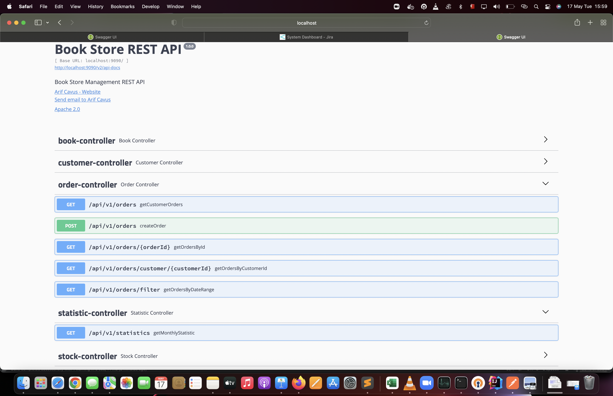

##ReadingIsGood online books Automation Project
ReadingIsGood is an online books retail firm which operates only on the Internet. Main target of ReadingIsGood is to
deliver books from its one centralized warehouse to their customers within the same day. That is why stock consistency
is the first priority for their vision operations.

## FEATURES
    . Customer registration. Firstly You must to create user and get bareer token. 
     This operation is customer registiration. 
    • Order operation
    • observing the stock of books
    • List all of the customer's orders with Pagination
    • Showing the order details
    • Get Monthly Statistics  

## TOOLS
- Java 11
- Spring Boot 2.5.2
    - Spring Security
    - Bearer Token Auth (JWT)
    - Spring Data MongoDB
- Lombok
- MongoDB
- Swagger
- Docker
- Docker Compose
- Redis(I think stock count race condition problem solved via Redis Lock Mechanism But I am not sure.
Couchbase technology maybe more proper solution to race condition problem concurrent thread architecture. )

## COMPILE AND RUN

**Compile**

Requires **JDK11**, **Maven** and **Docker**.

Firstly mongo db docker run for the database connection. After you should run below docker command.

    > docker-compose up --build -d

## USAGE

Ready Collection path for test functionalities of assignment: 

    /postman/Book Store.postman_collection.json

**Swagger** can be accessed from:

http://localhost:9090/swagger-ui.html

There are root endpoint that:
   ` > localhost:9090/api/v1/customers
    > localhost:9090/api/v1/stocks
    > localhost:9090/api/v1/orders
    > localhost:9090/api/v1/books
    > localhost:9090/api/v1/statistics
`

